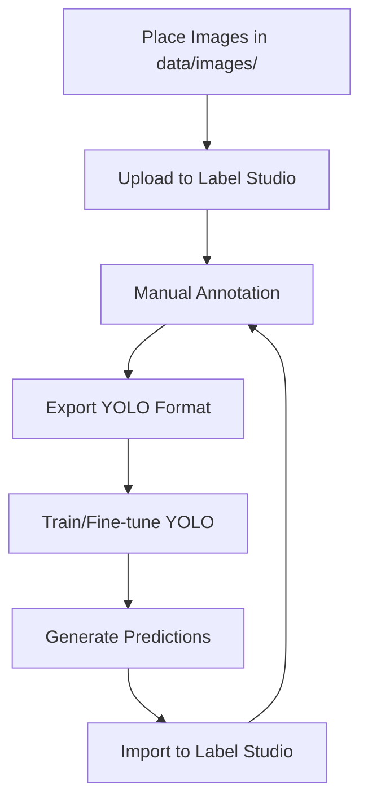

# 🚀 YOLO + Label Studio Integration Kit

Complete end-to-end setup for integrating **Label Studio** with **YOLO (v8/v11)** for semi-automatic dataset labeling and model iteration.

This kit automates:
- Label Studio project setup
- Image upload and management
- Manual labeling workflow
- Export to YOLO format
- Model training and fine-tuning
- Auto-labeling predictions for iterative improvement

**Enable a human-in-the-loop training workflow** for continuous model improvement.

---

## 📋 Table of Contents

- [Features](#features)
- [Quick Start](#quick-start)
- [Installation](#installation)
- [Workflow](#workflow)
- [Scripts](#scripts)
- [Configuration](#configuration)
- [Docker Setup](#docker-setup)
- [Label Configs](#label-configs)
- [Supported YOLO Versions](#supported-yolo-versions)
- [Troubleshooting](#troubleshooting)
- [License](#license)

---

## ✨ Features

- **Automated Setup**: Scripts for complete Label Studio + YOLO integration
- **Docker Support**: Run Label Studio and ML backend in containers
- **Multi-YOLO Support**: Works with YOLOv5, YOLOv8, YOLOv11, YOLO-OBB, YOLO-Seg, YOLO-Pose
- **Human-in-the-Loop**: Continuous model improvement through annotation correction
- **Auto-Labeling**: Use trained models to pre-annotate new images
- **YOLO Format Export**: Native YOLO format for seamless training

---

## 🚀 Quick Start

### 1. Clone and Setup

```bash
git clone <your-repo-url>
cd yolo-labelstudio-kits

# Create virtual environment
python -m venv venv
source venv/bin/activate  # On Windows: venv\Scripts\activate

# Install dependencies
pip install -r requirements.txt
# OR
pip install -e .
```

### 2. Configure Environment

```bash
# Copy example environment file
cp .env.example .env

# Edit .env and add your Label Studio API key
# Get it from: Label Studio UI → Account → Access Token
```

### 3. Start Label Studio

**Option A: Using Docker (Recommended)**
```bash
docker compose up -d
```

**Option B: Local Installation**
```bash
python scripts/1_start_labelstudio.py
```

Access Label Studio at: http://localhost:8080

### 4. Run the Workflow

```bash
# Create project
python scripts/2_create_project.py

# Add images to data/images/ then upload
python scripts/3_upload_images.py

# Label images in Label Studio UI (http://localhost:8080)

# Export annotations
python scripts/4_export_yolo.py

# Extract export
unzip data/exports/export.zip -d data/exports/

# Train model
python scripts/5_train_yolo.py --data data/exports/export/data.yaml

# Generate predictions for unlabeled images
python scripts/6_predict_unlabeled.py
```

---

## 📦 Installation

### Requirements

- Python >= 3.8
- Docker & Docker Compose (for containerized setup)

### Install Python Dependencies

```bash
pip install -r requirements.txt
```

Or using pyproject.toml:

```bash
pip install -e .
```

### Dependencies Included

- `label-studio` - Annotation platform
- `label-studio-sdk` - Python SDK for Label Studio API
- `ultralytics` - YOLO implementation
- `python-dotenv` - Environment configuration

---

## 🔄 Workflow



### Step-by-Step Process

1. **Initial Setup**: Create Label Studio project with YOLO label configuration
2. **Upload Images**: Bulk upload images for annotation
3. **Manual Labeling**: Annotate images in Label Studio UI
4. **Export**: Download annotations in YOLO format
5. **Training**: Fine-tune YOLO model on labeled data
6. **Prediction**: Use model to auto-label new images
7. **Review & Correct**: Import predictions, fix errors, repeat

---

## 🛠 Scripts

### 1️⃣ `scripts/1_start_labelstudio.py`

Start Label Studio server locally (non-Docker setup).

```bash
python scripts/1_start_labelstudio.py
```

**Note**: Docker users should use `docker compose up` instead.

---

### 2️⃣ `scripts/2_create_project.py`

Create a Label Studio project with YOLO object detection configuration.

```bash
python scripts/2_create_project.py --title "My YOLO Project"
```

**Output**: Project ID (save this to `.env` as `PROJECT_ID`)

**Features**:
- Prevents duplicate project names by default
- Use `--allow-duplicate` to create projects with same name
- Lists existing projects if duplicate detected

**Example with duplicate prevention**:
```bash
# First time - creates project
python scripts/2_create_project.py --title "obj-detection"

# Second time - shows error and existing projects
python scripts/2_create_project.py --title "obj-detection"

# Override to allow duplicate
python scripts/2_create_project.py --title "obj-detection" --allow-duplicate
```

---

### 🗑️ `scripts/delete_project.py`

Delete a Label Studio project by ID or title.

```bash
# Delete by ID
python scripts/delete_project.py --id 1

# Delete by title (searches first)
python scripts/delete_project.py --title "My YOLO Project"

# Skip confirmation prompt
python scripts/delete_project.py --id 1 --yes
```

**Safety**: Requires confirmation unless `--yes` flag is used.

---

### 3️⃣ `scripts/3_upload_images.py`

Upload images from `data/images/` to Label Studio.

```bash
# Upload to default project (from .env)
python scripts/3_upload_images.py

# Upload to specific project
python scripts/3_upload_images.py --project-id 2

# Upload from custom directory
python scripts/3_upload_images.py --image-dir path/to/images

# Force upload duplicates
python scripts/3_upload_images.py --force
```

**Features**:
- Automatically checks for existing images in the project
- Skips duplicate uploads by default
- Shows summary of new vs existing images
- Use `--force` to upload duplicates anyway

**Supported formats**: jpg, jpeg, png, bmp, gif, webp

**Example output**:
```
🔗 Connecting to Label Studio at http://localhost:8080...
📁 Found 150 images in data/images
🔍 Checking for existing images in project 1...
   Found 100 existing images

⚠️  Skipping 100 duplicate images:
   - image001.jpg
   - image002.jpg
   ...

⬆️  Uploading 50 new images to project 1...

✅ Successfully uploaded 50 images!

📊 Upload Summary:
   New images uploaded: 50
   Duplicates skipped: 100
   Total in directory: 150
```

---

### 4️⃣ `scripts/4_export_yolo.py`

Export labeled annotations in YOLO format.

```bash
python scripts/4_export_yolo.py --project-id 1
```

**Output**: `data/exports/export.zip`

Extract it:
```bash
unzip data/exports/export.zip -d data/exports/
```

---

### 5️⃣ `scripts/5_train_yolo.py`

Train YOLO model on exported dataset.

```bash
python scripts/5_train_yolo.py \
  --data data/exports/export/data.yaml \
  --epochs 50 \
  --imgsz 640
```

**Options**:
- `--data`: Path to YOLO data.yaml
- `--base-model`: Pretrained model (default: yolo11n.pt)
- `--output`: Save path for trained model
- `--epochs`: Training epochs
- `--imgsz`: Image size

**Output**: Trained model saved to `models/updated_model.pt`

---

### 6️⃣ `scripts/6_predict_unlabeled.py`

Generate predictions for new unlabeled images.

```bash
python scripts/6_predict_unlabeled.py \
  --model models/updated_model.pt \
  --image-dir data/images \
  --conf 0.25
```

**Options**:
- `--model`: Path to trained model
- `--image-dir`: Directory with images
- `--output-dir`: Prediction output directory
- `--conf`: Confidence threshold

**Output**: Predictions saved to `data/predictions/predict/`

---

## ⚙️ Configuration

### Environment Variables (`.env`)

```bash
# Label Studio
LABEL_STUDIO_URL=http://localhost:8080
LABEL_STUDIO_API_KEY=your_api_key_here
PROJECT_ID=1

# Paths
IMAGE_DIR=data/images
EXPORT_DIR=data/exports
PREDICTIONS_DIR=data/predictions

# Models
BASE_MODEL_PATH=models/base_model.pt
UPDATED_MODEL_PATH=models/updated_model.pt

# Training
EPOCHS=30
IMAGE_SIZE=640
MODEL_SCORE_THRESHOLD=0.25
```

### Get API Key

1. Open Label Studio UI (http://localhost:8080)
2. Go to **Account** → **Access Token**
3. Copy token and add to `.env`

---

## 🐳 Docker Setup

### Start Services

```bash
docker compose up -d
```

This starts:
- **Label Studio** on port 8080
- **YOLO ML Backend** on port 9090

### Verify ML Backend

```bash
curl http://localhost:9090/health
# Expected: {"status":"UP"}
```

### Connect ML Backend to Project

1. Go to Label Studio project settings
2. Navigate to **Model** → **Connect Model**
3. Enter: `http://localhost:9090`
4. Save

Now predictions will appear automatically during annotation!

### Stop Services

```bash
docker compose down
```

---

## 🏷 Label Configs

### Object Detection (Bounding Boxes)

```xml
<View>
  <Image name="image" value="$image"/>
  <RectangleLabels name="label" toName="image" model_score_threshold="0.25">
    <Label value="Person" background="red"/>
    <Label value="Car" background="blue"/>
    <Label value="Bicycle" background="green"/>
    <Label value="Motorcycle" background="yellow"/>
  </RectangleLabels>
</View>
```

### Instance Segmentation (Polygons)

```xml
<View>
  <Image name="image" value="$image"/>
  <PolygonLabels name="label" toName="image" model_score_threshold="0.25">
    <Label value="Car" background="blue"/>
    <Label value="Person" background="red"/>
  </PolygonLabels>
</View>
```

### With ML Backend Auto-predictions

Add `model_path` attribute:

```xml
<RectangleLabels name="label" toName="image" 
                 model_score_threshold="0.25" 
                 model_path="models/updated_model.pt">
  <Label value="Person" background="red"/>
  <Label value="Car" background="blue"/>
</RectangleLabels>
```

---

## 📊 Supported YOLO Versions

| Version   | Supported | Model Name Example | Notes                  |
|-----------|-----------|-------------------|------------------------|
| YOLOv5    | ✅        | `yolov5nu.pt`     | Classic YOLO           |
| YOLOv8    | ✅        | `yolov8n.pt`      | Default in backend     |
| YOLOv11   | ✅        | `yolo11n.pt`      | No "v" in name         |
| YOLO-OBB  | ✅        | `yolo11n-obb.pt`  | Oriented bounding boxes|
| YOLO-Seg  | ✅        | `yolo11n-seg.pt`  | Instance segmentation  |
| YOLO-Pose | ✅        | `yolo11n-pose.pt` | Keypoint detection     |

**Requirement**: `ultralytics>=8.0.0` (latest recommended)

### Download Pretrained Models

```bash
# Using Python
from ultralytics import YOLO
model = YOLO('yolo11n.pt')  # Auto-downloads

# Or download manually
wget https://github.com/ultralytics/assets/releases/download/v8.1.0/yolo11n.pt -P models/
```

---

## 🧩 Folder Structure

```
yolo-labelstudio-kits/
│
├── docker-compose.yml          # Docker services configuration
├── requirements.txt            # Python dependencies
├── pyproject.toml              # Project metadata
├── .env.example                # Environment template
├── .gitignore                  # Git ignore rules
├── README.md                   # This file
│
├── scripts/                    # Automation scripts
│   ├── 1_start_labelstudio.py
│   ├── 2_create_project.py
│   ├── 3_upload_images.py
│   ├── 4_export_yolo.py
│   ├── 5_train_yolo.py
│   └── 6_predict_unlabeled.py
│
├── models/                     # YOLO models
│   ├── .gitkeep
│   ├── base_model.pt          # Pretrained model
│   └── updated_model.pt       # Fine-tuned model
│
└── data/
    ├── images/                 # Input images for annotation
    │   └── .gitkeep
    ├── exports/                # YOLO format exports
    │   └── .gitkeep
    └── predictions/            # Model predictions
```

---

## 🔧 Troubleshooting

### Issue: API Key Not Working

**Solution**: Regenerate API key in Label Studio:
1. Go to Account → Access Token
2. Click "Reset Token"
3. Update `.env` with new token

### Issue: Model Not Found

**Solution**: Download pretrained model:
```bash
python -c "from ultralytics import YOLO; YOLO('yolo11n.pt')"
```

### Issue: Export Empty or Fails

**Solution**: Ensure images are labeled:
1. Check Label Studio UI for completed tasks
2. At least one image must have annotations
3. Verify project ID is correct

### Issue: Docker ML Backend Not Connecting

**Solution**: Restart services and check logs:
```bash
docker compose restart yolo-ml-backend
docker compose logs yolo-ml-backend
```

### Issue: Predictions Not Showing in UI

**Solution**: 
1. Verify ML backend is running: `curl http://localhost:9090/health`
2. Check model path in label config
3. Ensure `model_score_threshold` is not too high

---

## 🔁 Iterative Improvement Cycle

1. **Initial Training**: Label 100-200 images manually
2. **First Model**: Train YOLO on initial dataset
3. **Auto-Label**: Generate predictions on 500 new images
4. **Review**: Correct predictions in Label Studio (much faster than manual)
5. **Retrain**: Export corrected data, retrain model
6. **Repeat**: Each cycle improves model accuracy

**Result**: High-quality dataset with minimal manual effort!

---

## 📝 Advanced Usage

### CLI Prediction Tool

For large-scale predictions without timeout:

```bash
python cli.py \
  --ls-url http://localhost:8080 \
  --ls-api-key $LABEL_STUDIO_API_KEY \
  --project 1 \
  --tasks 1,2,3
```

### Custom Label Config

Edit `scripts/2_create_project.py` to modify labels:

```python
LABEL_CONFIG = '''
<View>
  <Image name="image" value="$image"/>
  <RectangleLabels name="label" toName="image">
    <Label value="YourClass1" background="red"/>
    <Label value="YourClass2" background="blue"/>
  </RectangleLabels>
</View>
'''
```

### Batch Processing

Process multiple images in parallel:

```python
from ultralytics import YOLO
model = YOLO('models/updated_model.pt')

# Batch predict
results = model.predict(
    source='data/images',
    stream=True,
    save=True,
    save_txt=True
)
```

---

## 📄 License

MIT License - Free to use for research, demo, and deployment.

---

## 🤝 Contributing

Contributions welcome! Please:
1. Fork the repository
2. Create a feature branch
3. Submit a pull request

---

## 📚 Resources

- [Label Studio Documentation](https://labelstud.io/guide/)
- [Ultralytics YOLO](https://docs.ultralytics.com/)
- [Label Studio ML Backend](https://github.com/HumanSignal/label-studio-ml-backend)

---

## 💡 Tips

- Start with a small dataset (50-100 images) for initial training
- Use confidence threshold ~0.25 for predictions to catch more objects
- Review and correct predictions - faster than manual labeling
- Retrain every 200-300 corrected images for best results
- Use GPU for training: `device=0` in train script

---

**Happy Labeling! 🎯**
